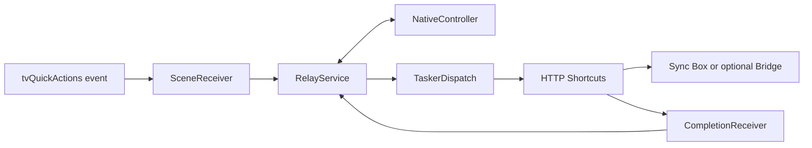

# Architecture

Hue Sync Relay separates Android event handling from authenticated device requests. The public package is `dev.huesync.relay`. Its controller derives from an earlier working installation. The public APK and freshly generated imports have offline/build validation and remain uninstalled on a TV. Matching generic behavior in the upgraded private installation has API evidence for idle recovery, sticky recreation after a simulated crash and normal idle sleep/wake; the owner also confirmed the strip kept following while entering and leaving TiviMate multiview. See [TESTING.md](TESTING.md).

## Component map

Java source is under [`android/src/dev/huesync/relay/`](../android/src/dev/huesync/relay/).

| File | Responsibility |
| --- | --- |
| [`contract.json`](../contract.json) | Public package, action prefix, receiver, callback scheme, nonce variable, and nine fixed shortcut identities. |
| [`SceneReceiver.java`](../android/src/dev/huesync/relay/SceneReceiver.java) | Accepts supported explicit broadcasts and starts the foreground service. Discards caller-supplied extras; never opens an activity. |
| [`RelayService.java`](../android/src/dev/huesync/relay/RelayService.java) | Connects Android screen/display/audio events, elapsed time, persistence, dispatch and completion to the controller. |
| [`NativeController.java`](../android/src/dev/huesync/relay/NativeController.java) | Network-free state machine: one pending request, deadlines, readiness checks, sleep compensation and scene ordering. |
| [`TaskerDispatch.java`](../android/src/dev/huesync/relay/TaskerDispatch.java), [`CompletionReceiver.java`](../android/src/dev/huesync/relay/CompletionReceiver.java) | Invoke HTTP Shortcuts' Tasker-compatible service and return completion to the currently running relay. A late callback does not start a stopped relay. |
| [`NativeShortcutIds.java`](../android/src/dev/huesync/relay/NativeShortcutIds.java), [`RelayPolicy.java`](../android/src/dev/huesync/relay/RelayPolicy.java) | Resolve the fixed helper/scene identities and allowed scene payloads. |
| [`EmbyAudioGate.java`](../android/src/dev/huesync/relay/EmbyAudioGate.java) | Optional audio fallback gated by tvQuickActions' Emby foreground context. |
| [`tools/configure_tvqa.py`](../tools/configure_tvqa.py) | Creates a scoped Merge import from the user's fresh tvQuickActions export. Preserves unrelated settings and existing lifecycle actions. |
| [`tools/generate_config.py`](../tools/generate_config.py), [`templates/`](../templates/) | Validate user configuration and construct private, pinned HTTP Shortcuts requests and response scripts. |
| [`tools/pair_sync_box.py`](../tools/pair_sync_box.py) | Optional setup-time registration, after checking the user's independently verified certificate pin. |

## Events and request flow



The core event source is **tvQuickActions**: screen on → `SYNC_START`, screen off → `SYNC_STOP`, power on/boot → `SYNC_BOOT`, all under the `dev.huesync.relay.` prefix. The [Android manifest](../android/AndroidManifest.xml) has no boot receiver. The service's screen-off listener is registered only while the service exists; it does not replace external startup events. The service returns `START_STICKY`. A new service instance, including null-intent recreation, reconciles `PowerManager.isInteractive()` instead of replaying the saved desired state: awake schedules a bounded wake check; asleep schedules bounded Stop/off reconciliation. Explicit boot retains its 20-second delay. Android decides whether and when to recreate the service; force-stop is not an ordinary process kill.

While resident and the TV is interactive, the service can request recovery after the default display's mode ID, dimensions or refresh rate change. That comparison does not inspect HDR metadata. An HDR-only transition may produce no detectable change. Duplicate wake/recovery events inside an active window are coalesced.

The generated HTTP import always has nine hidden records:

| Slots | Requests |
| --- | --- |
| Core: `PROBE`, `START`, `STOP` | `GET /api/v1/`; `PUT /api/v1/execution` to enable video sync on the configured input; the same PUT endpoint to disable sync. |
| Optional: `CINEMA`, `PAUSE`, `READ`, `CYCLE`, `READ_CHECK`, `READ_RECALL` | All six are network-free no-ops when disabled. When enabled, Cinema/Pause/Cycle recall scenes; native Read becomes a sensor GET followed, if permitted, by a separate recall PUT. The reserved `READ` record itself remains a harmless no-op. |

Each dispatched HTTP helper makes one top-level request. Do not introduce nested shortcut execution, queued activity launches or script-managed retry loops: the native controller owns sequencing. Read's second request is dispatched only if the first decision is still current. Optional time/sensor guards and manual Cycle behavior are described in [SCENES.md](SCENES.md).

## Completion and timing boundaries

Each dispatch gets a random nonce and a generation. The completion intent uses `huesyncrelay://complete/<nonce>`. Core and Read helper requests also receive the request-local variable `hsr_request_nonce`; their JSON results contain `kind`, `nonce`, `ok`, `ready`, `active` and `video`.

The service checks the callback URI against the pending nonce. Core/Read completion additionally requires matching result kind/nonce and boolean fields; `ok` is gated by the Tasker success result code. Scene completion is an acknowledgement: after checking the callback nonce, the controller clears the scene request without requiring its JSON result. This permits a time-guarded scene to abort before HTTP and still finish. Do not assume every scene result carries the same payload guarantees as a Probe result.

Controller times use elapsed realtime. Optional scene windows use the TV's local wall clock.

- Wake schedules its first Probe after 2 seconds; boot after 20 seconds **from event receipt**, not from physical power-on.
- A recovery decision window lasts 90 seconds, with at most 12 Probes. Typical retry/verification checks are 5 seconds apart. Start requires more than 15 seconds left for the command and verification.
- Start/Stop completion schedules a Probe after 3 seconds. Off confirmation requires two inactive observations, with a 10-second compensation interval after the first.
- A pending callback may wait up to 45 seconds. A timeout ends uncertain startup work; asleep state can request another Stop within its remaining window. The service commits a pending-request lease before dispatch, and recreation waits out a still-valid lease before sending another request. Elapsed-time validation rejects expired or clearly invalid leases; explicit boot clears the old lease. This protects against overlapping a possibly still-running external request, without replaying its old callback or decision.
- While awake and idle, one Probe runs after 60 seconds. Healthy, failed or not-ready results return to idle and schedule the next minute check. A valid ready result showing inactive or non-video sync opens a new 90-second recovery window, counting that Probe toward the 12-Probe limit. Maintenance shares the one-request slot and waits behind scenes and active recovery.
- Pause waits 3 seconds so newer playback can cancel it. Read decisions carry both generation and scene revision; sleep or a newer scene invalidates them.

These are scheduling limits, not guarantees that hardware changes state within exactly 90 seconds. An HTTP request already sent cannot be recalled. Sleep supersedes pending decisions and prioritizes Stop once the in-flight operation finishes or times out. Sleep disables idle maintenance and clears queued scene decisions. A manual Hue-app Stop while the relay stays awake may be reversed by maintenance. Explicit relay `SYNC_STOP` disables maintenance until later applicable work; it is not a persisted pause across process recreation. Fault detection may take up to 60 seconds plus request/readiness delays. Status checks cannot detect API-active but visibly dark lights.

## Device trust and observable state

The relay has no Android `INTERNET` permission and contains no device token or Bridge key. HTTP Shortcuts stores the user's generated configuration and sends pinned HTTPS requests. The Sync Box uses a Bearer token; optional Bridge calls use a separate `hue-application-key`. Generation performs no network operations. Certificate identity must be verified before pairing/configuration; see [SECURITY.md](SECURITY.md).

[`templates/probe.js`](../templates/probe.js) derives readiness from the selected input, HDMI-active/linked flags, supported video and positive dimensions. `active` and `video` are API-reported state. Neither these flags nor a successful Start response prove the lamps visibly follow the picture. Manual sync and visual confirmation remain necessary installation checks.

The Emby fallback uses anonymous Android media/game audio activity **only while tvQuickActions reports Emby foreground**. It debounces playing for one second and cancels pending Emby pause on exit/resume. It does not identify the audio source by app UID and is not a general fallback for every media app. Process recreation deliberately discards cached Emby foreground context and pending scenes; only a fresh `EMBY_ENTER` event enables this fallback again. Existing Cinema/Pause/Read guards and scene rules are otherwise unchanged.

## Checks and change boundaries

Run from the repository root:

```sh
python3 -B -m unittest discover -s tests -p 'test_*.py'
python3 -B android/build.py --test-only
```

The setup tests exercise generated JavaScript with Node.js and synthetic data. Android source checks and controller tests need a JDK. These commands do not contact devices. APK building is documented in [`android/BUILDING.md`](../android/BUILDING.md).

When changing an identity, update `contract.json`, its Java mappings and the generators together; contract tests should catch drift. Keep credentials and personalized imports out of the repository. Preserve serialization, nonce checks, generation/revision invalidation, bounded recovery and certificate verification when extending behavior.
